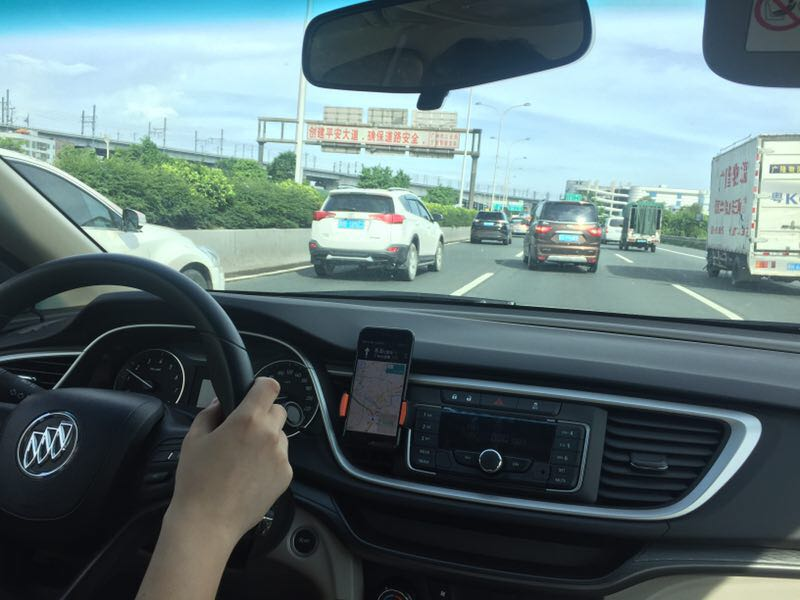
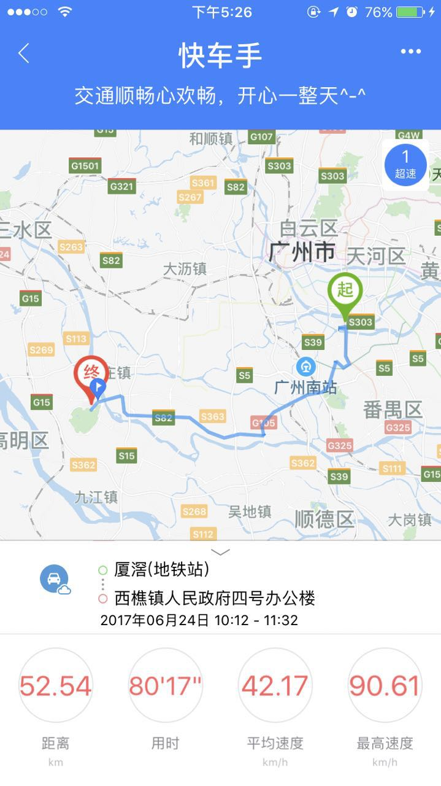
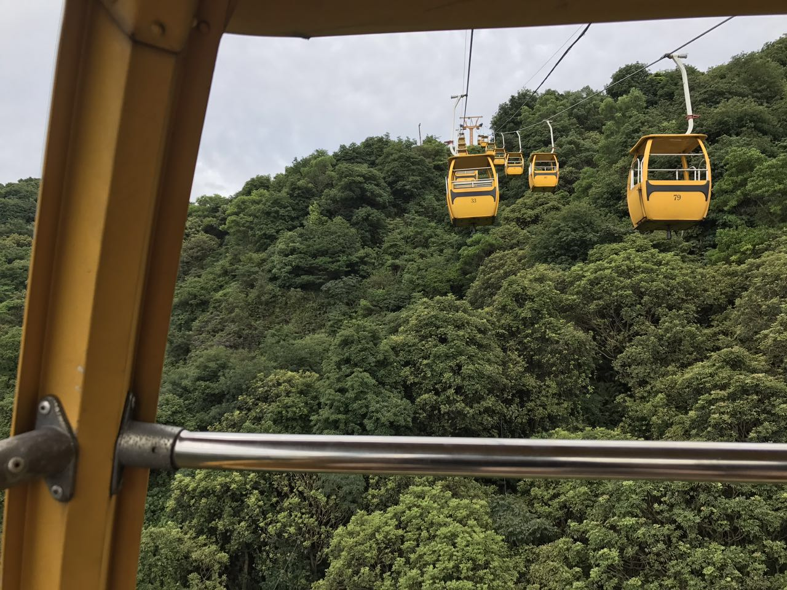
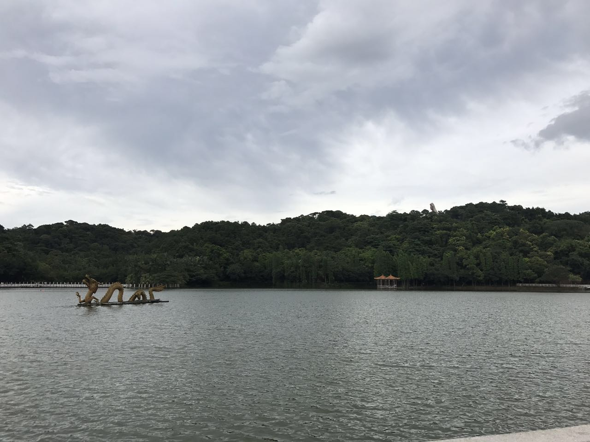
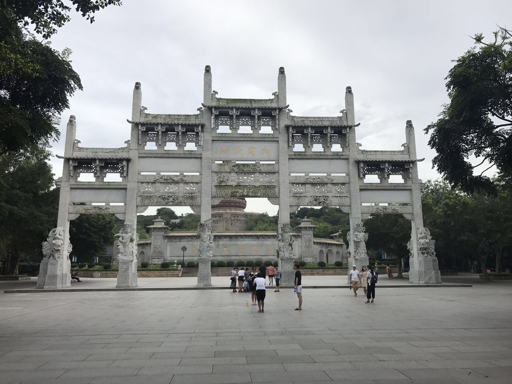
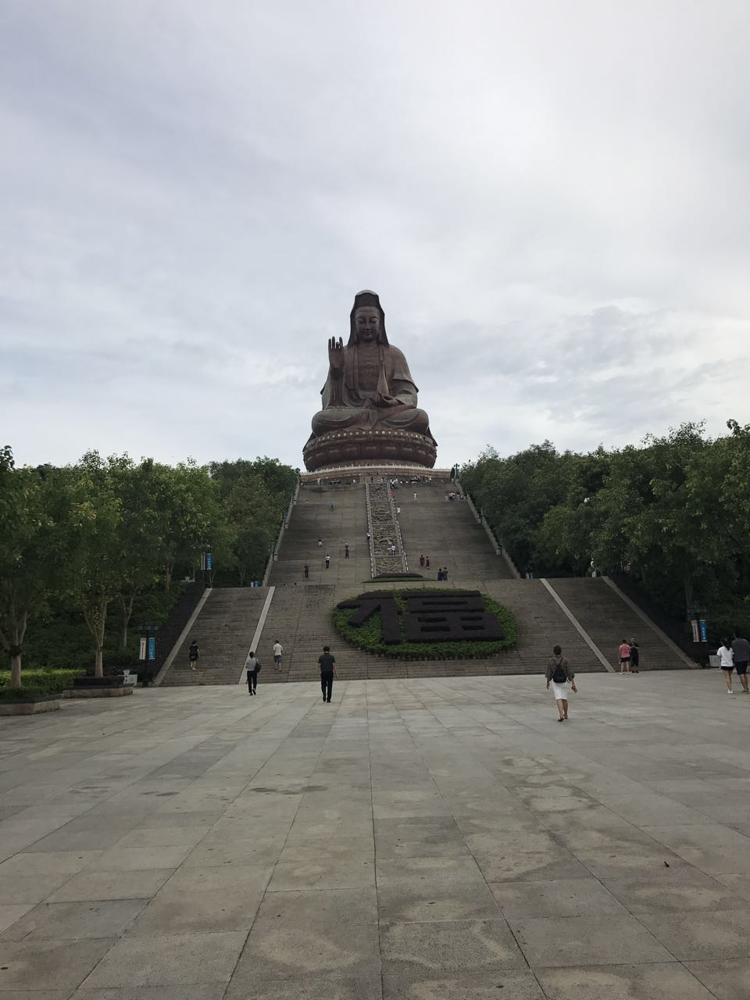
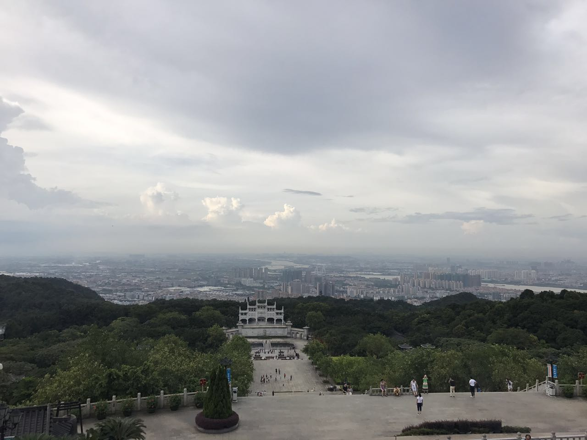
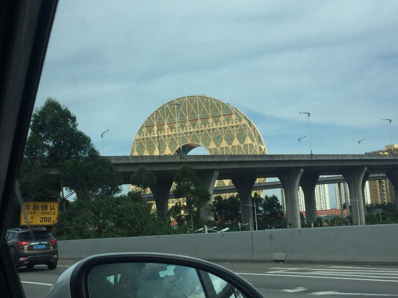

西樵山自驾游
--------
> 2017-06-24

难得的双休，决定带女友去佛山的西樵山游玩。虽然我在西樵读了3年高中，然而，居然还没有上过西樵山，简直『可耻』！

本次出行选择了自驾车出行，游玩时间的相对弹性，不用为了赶班车而。我在神州租车租了一辆『别克英朗』，车子很新，但是最低配置那一款。

在厦滘地铁口取车，导航去西樵山

先去西樵中心区域吃饭

入住西樵大酒店，坐落在就在西樵山山脚

上山首选索道，20元搭乘一次，30元包来回。门票佛山人10元，外市70元

忘了叫什么湖，反正年年的醒狮大赛都在这里军行

还要继续爬山

快到最高点

南海观音，应该是全国最大的观音

西樵山最高处眺望

归来时路过广州圆大厦，像一个铜钱

#### 后感：

- 不知道要写游记，所以没有拍很多照片，有点失望
- 西樵山很大，如果想在上面走完一圈，建议开车上山
- 山顶有个斋菜的小饭馆，由于时间关系没有吃到，建议中午的时候去吃

