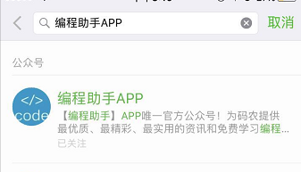

编程助手-未完成的APP
--------
> 2017-07-09 Jayin

#### 回顾

编程助手APP(前身为Java学习助手),提交第一次代码时间是 2014年4月25日，第一个版本发布于2014年5月5日，真是不知道不觉，已经有3周岁。而我也从大学迈向了社会，已经有1年了。

当年的APP口号是“你拉屎的时候，一定要用Java学习助手”，定位就是碎片时间学习。做这个APP的初衷是方便自己查文档，充分利用一些碎片时间。比如大学经常有很多无聊的课程（思想政治课程），也有些为了学分的通识课（艺术，经济相关），还有不能不参加的会议，我都是带着手机打开 APP 就能在上面学习了。一开始，只有java相关的内容，因为我自己就在学 Android 开发,在恶补Java的基础知识。

后来加入更多教程（Python, Android），也开通了“新鲜事”功能，提供资讯类服务。一开始还是挺有激情的（主要是在读相对有空），更新得相对勤奋。到了2015年4月，出现了一点转折。

#### 转折

2015年4月，我去了深圳开始我的实习之旅，做的是前端开发。实习才发现，时间是多么宝贵，除了白天工作，晚上还得恶补工作上的不足，哪里不熟悉就学习哪里。不能抱着工作的时间点才去学习的心态，其他时间搞自己的事情。工作，其实平时积累的知识去运用，老板们可不是找你回来学习，而是来产出的。我也深刻体会那种程序员的工作压力(项目赶着上线)，生命不息，加班不止。于是停更了好几个月，没有更新的那段日子里，感觉是消失了一样。

后来，2015年的10月份，换了一间公司工作，实习阶段，相对轻松，做的是本行安卓开发，所以也保持着更新。一直到2016年年初，公司转型，我负责工作越来越繁重，加上那会在准备毕业设计等相关工作，更新频率逐渐下降。后来索性停止了更新。

#### 回归

在制定2017年的计划，一直想把继续开发编程助手的提上日程，可是一直没有动手。到了年中（6月份），我感叹时间过得实在太快，都毕业一年了，现在还不下决心，更待何时？

第一阶段，我会重新梳理开发流程、工具链和资料（以前的各种账号和APP的签名文件也不知道放哪儿），先从资讯类的方向运营着。

我已经开通微信公众账号，第一时间放出最新消息和IT类的资讯，保持一定的更新频率。微信添加公众号，搜索“编程助手APP”，如下图

第二阶段，丰富教程文档，新增Python3,HTML,CSS3等内容

第三阶段，新增面试笔试题目测试功能，让你找工作时无论是笔试或者面试都得心应手。

大概的更新计划就是这样了，如果你有更好的想法，可以通过微信公众号给我留言。

