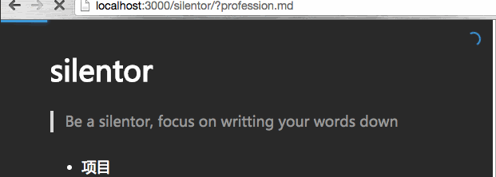

load-progress
=============
>bring loading state to silentor



### 使用

* 加入对应的js/css

```html
<script src="vendor/jquery-1.11.1.min.js"></script>

<!-- extensions START-->
<link rel="stylesheet" href="vendor/extension/load-progress/dist/main.css">
<script src="vendor/extension/load-progress/dist/main.js"></script> 
<!-- extensions END-->

<!-- core.js -->
<script src="vendor/core.js"></script> 
```

### 自定义

自定义颜色，进度条宽度等，修改`extensions/load-progress/src/custom.css`

然后
```
cd path/to/silentor/src/extensions/load-progress
make
```
