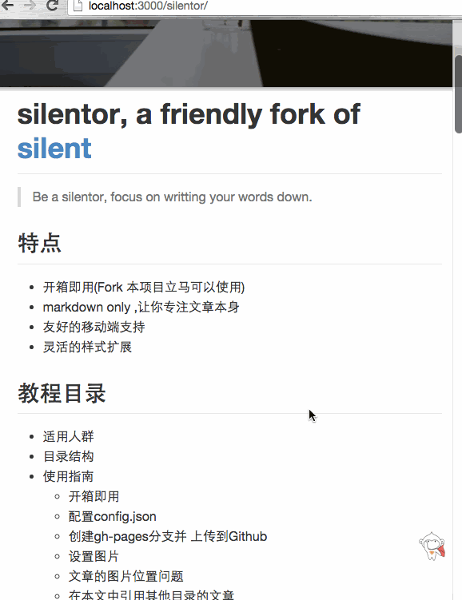

scroll-top
==========

仿照[coding.net冒泡页]() 一键飞到顶部



### 使用

1. 插入猴子图片

```html 
<body>

    <!-- sidebar -->
    <div class="sidebar">
         .....
    </div>

    <!-- main -->
    <div class="main" id="main">
    </div>

    <!--  extension: scroll top-->
    <div class="btn-scrolltop" style="display: none">
            
    </div>
</body>
```

2. 加入css/js到扩展区域

```html
<!-- extensions START-->

<!-- scroll top -->
<link rel="stylesheet" href="vendor/extension/scroll-top/main.css">
<script src="vendor/extension/scroll-top/main.js"></script> 

<!-- extensions END-->
```