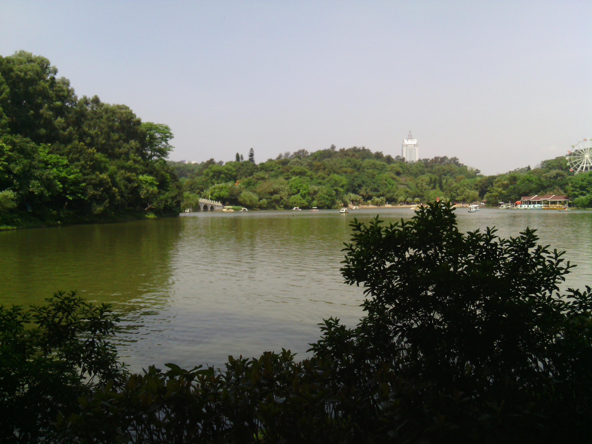

五一劳动节的最后一日
---
    
  昨日说了去东湖公园写代码。结果没写成，但是去了2次！8点多起床，步行去东湖的时候已经快9点。第一次去的时候，颇有感触。这是五一劳动节的最后一日，东湖相当多人，但是给我一种彷如置身于外国公园的景象：一群人打着乐器厂粤剧，旁边就有人跳交谊舞、广场舞；有些小孩在广场吹气泡，有些孩子在快活地跑着，妈妈在后面跟着跑；有些老夫妇带着收音机，一边播着音乐一边在拖着手散步；也有一些老人在湖边，做着简单的肢体活动，附近的游乐场传来阵阵的笑声、、、
  
  对，而且今日真实晴空万里，早上的东湖，简直给我一种前所未有的悠闲感，于是我也绕着东湖走了走了一圈，最后在湖边坐了下来，捧着kindle看《黑客与画家》。这真的是一种享受。

  下午3点多，亮爷来了工作室叫上咱们再去一次，那是我觉得时间过得真快，因为我以为当时才1点多！跟亮爷、王剑锋、志雄去主要是扯扯蛋蛋，聊一些看法之类的，每次聊都有收获，对了，要学会聆听。

  代码没写成，但是悠闲一日，整个人的状态又调整过来的，战斗力+10086 明日又开会了，任务沉重（逃

就这么愉快地决定
---
  这次没有写成代码，当然啦，会有下次的。觉得周末话一个早上or下午去东湖逛逛，感觉还是非常良好，不在那么宅了，而且在这么悠闲的地方思考、反思一下人生还是挺不错的。咱这么努力干，都不是为了生活好点，追随自己的理想吗？但是时间长了，却没有去思考自己是否做得好，那里需要补充，到底是为了什么而这么做，这么做失去了什么得到了什么。。。。

  所以啊，我个人打算每个周末都去一下东湖，放松一下，思考人生，就这么愉快地决定了。
